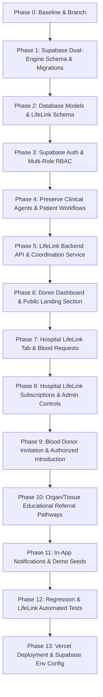

# CuraReach 360 + LifeLink: Phase 0 Baseline & Architecture Report

**Project:** CuraReach 360  
**Tagline:** Predict the Gap. Adapt the Pathway. Complete the Care.  
**Module Added:** CuraReach LifeLink — Donor Connect  
**Execution Branch:** `feature/lifelink-supabase-vercel`  
**Database Backup:** `backend/curareach360.db.baseline.bak`  
**Baseline Date:** September 26, 2026  

---

## 1. Directory Structure

```
curareach-agentx/ (also synchronized to healthcare/)
├── api/
│   └── index.py                     # Vercel Serverless Function entrypoint
├── backend/
│   ├── app/
│   │   ├── agents/                  # 4 Clinical AI Agents (Intake, Intelligence, Referral, Rescue)
│   │   ├── api/v1/                  # 12 Existing REST Routers
│   │   ├── core/                    # config.py, database.py, security.py
│   │   ├── models/                  # 10 SQLAlchemy ORM Model files (35 existing tables)
│   │   ├── services/                # seed_service.py, orchestrator.py, llm_service.py
│   │   ├── state_machine/           # 18-State Clinical Transition Engine
│   │   └── main.py                  # Master FastAPI App
│   ├── tests/
│   │   └── test_api_and_rules.py    # 18 pytest tests (100% passing baseline)
│   ├── curareach360.db              # Active SQLite database
│   ├── curareach360.db.baseline.bak # Pre-migration snapshot backup
│   ├── requirements.txt             # Python backend dependencies
│   └── run_backend.py               # Local Uvicorn server runner
├── frontend/
│   ├── src/
│   │   ├── components/
│   │   │   ├── dashboards/          # 5 Role Dashboards: Patient, Worker, Doctor, Hospital, Admin
│   │   │   ├── common/              # Header, DemoScenarioModal
│   │   │   └── modals/              # Self-Registration, Case Evaluation
│   │   ├── services/
│   │   │   ├── curareachApi.ts      # Adaptive API client
│   │   │   └── api.ts
│   │   ├── types/
│   │   │   ├── curareach.ts         # TypeScript models
│   │   │   └── index.ts
│   │   ├── App.tsx                  # Dashboard switcher & layout
│   │   └── main.tsx
│   ├── package.json                 # React 19, Vite, Tailwind CSS
│   ├── vercel.json                  # Frontend SPA routing
│   └── vite.config.ts
├── package.json                     # Root npm orchestrator
├── requirements.txt                 # Root Python requirements for Vercel
├── vercel.json                      # Root Vercel serverless deployment config
└── README.md
```

---

## 2. Tech Stack & Framework Versions

- **Frontend:**
  - React `19.0.0`
  - TypeScript `~5.7.2`
  - Vite `8.3.0`
  - Tailwind CSS `3.4.17`
  - Lucide React `0.475.0`
  - Recharts `2.15.1`
- **Backend:**
  - Python `3.11.2`
  - FastAPI `0.141.1`
  - Uvicorn `0.53.0`
  - SQLAlchemy `2.1.0`
  - Pydantic `2.13.5`
  - PyJWT `2.15.0`
  - Passlib `1.7.4`
- **Database:**
  - Current: SQLite (`curareach360.db`) with Foreign Key enforcement (`PRAGMA foreign_keys=ON`)
  - Target: Supabase PostgreSQL with RLS, connection pooling, and dual-mode local/cloud fallback.

---

## 3. Inventory of Existing Tables (35 Tables)

1. `users`
2. `patient_profiles`
3. `community_worker_profiles`
4. `hospitals`
5. `hospital_departments`
6. `hospital_services`
7. `appointment_slots`
8. `clinical_cases`
9. `consent_records`
10. `symptom_submissions`
11. `uploaded_images`
12. `triage_assessments`
13. `clinician_reviews`
14. `referrals`
15. `referral_responses`
16. `facility_recommendations`
17. `appointments`
18. `follow_up_tasks`
19. `notifications`
20. `case_status_events`
21. `agent_executions`
22. `subscription_plans`
23. `organization_subscriptions`
24. `demo_invoices`
25. `patient_medical_history`
26. `patient_allergies`
27. `patient_surgeries`
28. `patient_medications`
29. `patient_family_history`
30. `patient_visit_notes`
31. `patient_diagnostic_reports`
32. `patient_prescriptions`
33. `treatment_invoices`
34. `treatment_invoice_items`
35. `treatment_payments`

---

## 4. Existing User Roles & Authentication

Defined in `app/core/security.py`:
- `PATIENT`
- `COMMUNITY_WORKER`
- `CLINICIAN`
- `HOSPITAL_STAFF`
- `CURAREACH_ADMIN`

New LifeLink Role to add:
- `DONOR`
- `AGENCY_ADMIN`
- `HOSPITAL_ADMIN`
- `PLATFORM_ADMIN`

---

## 5. Four Existing AI Agents & 18-State Machine

- **Clinical Intake Agent:** Symptom structure, urgency tier calculation, emergency guidance trigger.
- **Care Intelligence Agent:** Multi-attribute hospital capability and transit delay matching.
- **Adaptive Referral Agent:** Hospital referral packet and transport protocol selection.
- **Care Rescue Agent:** Post-referral follow-up, home-visit milestone tracking, case closure.
- **Clinical State Machine:** 18 states from `intake_pending` to `closed_resolved`, requiring human clinician sign-off before hospital transfer.

---

## 6. Baseline Test Status

- **Backend Pytest:** `18 passed in 3.71s` (100% passing)
- **Frontend Vite Build:** `built in 2.21s` with 0 errors
- **PPT/PDF Assets:** 0 files found (Protected from modification)

---

## 7. Migration Plan to Option A Target


